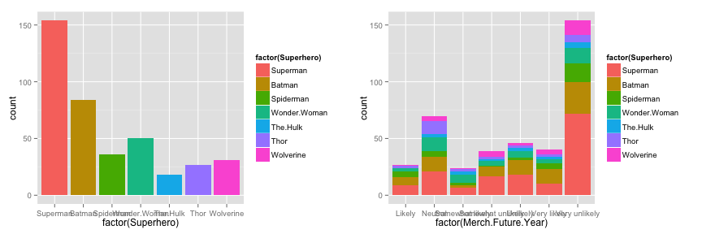

Data Products: Project Pitch
========================================================
title       : Data Science Certification on Coursera
author      : Kate Stohr
date        : August 23, 2015
font-family : 'Helvetica'

Favorite Superhero 
========================================================

It's been a fun ten months. I thought it would be fun to get to know the 'peers' who are grading projects a little better. In that spirit, here's the datascience equivalent of that perennial conversational icebreaker, "Who is your favorite superhero?"

Fig. 1: Data on demographic information and superhero preference was collected from 400 survey participants. 

 

Summary 
========================================================

This project analyzes demographic data collected from 400 survey takers asked to pick their favorite superhero from a group of popular superheros. The goal of the project is to build a tool that can predict a user's favorite superhero from a limited set of superheros based on a limited set of demographic data and some 'hints' from the user. 

<small>*Data Source*  
Data provided courtesy of: 
Ask Your Target Market, "[Superman](https://aytm.com/surveys/353802/stat/754346b79e6a9eeb44b8d64edfe1c520#)", June 11, 2015, ([wwww.aytm.com](http://www.aytm.com)). </small> 

Data Analysis
========================================================
left: 55%

<small>For this project, the training data was split into a training and a test set. I cleaned and pre-processed the data and fit a model with Random Forests. 

The initial model had low (41%) accuracy. To augment the model in the data product, I added inputs such as "Which superpower would you most like to possess?"

The data product collects user data, fits it to the model, and makes a prediction. User data is added to the dataset. After each session the data is updated and the model is retrained with the new data. </small>

***

<small>The data analysis showed: 

1. Women were more likely to choose Wonderwoman.
2. Older participants were more likley to choose Superman.
3. Participants who were more likely in the past or future to buy merchandise or watch superhero movies were more likely to pick less popular characters.  
4. Other factors, such as location or education, had little bearing on preference.</small>

Known Limitations
========================================================
There are a number of known issues with the resulting model: 

- The superhero list is limited, and may not include the true favorite of the respondent
- The list favors DC and Marvel comics heros, and is not reflective of world cultures 
- Demographic information may have little bearing on superhero preference, which may be the result of other variables such as sibling preference, exposure to television, or overall nerdiness; data for which is not available.
- Users should be advised that a correlation is not an indication of causation.

Enjoy.
